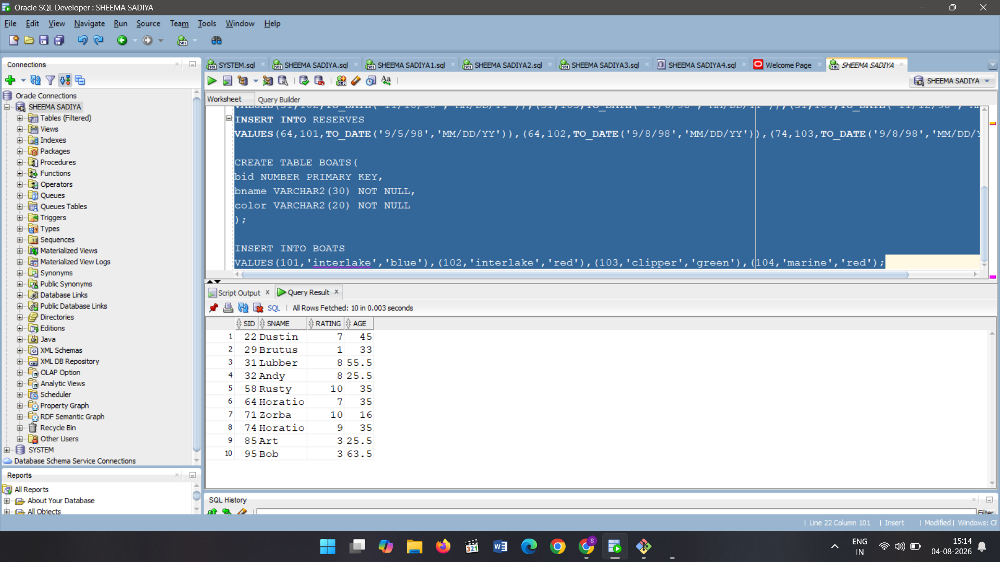

# EPXERIMENT 2 Started

```
SELECT * FROM SAILORS;
SELECT * FROM BOATS;
SELECT * FROM RESERVES;

INSERT INTO RESERVES
VALUES(22,101,TO_DATE('10/10/98','MM/DD/YY'));
INSERT INTO RESERVES
VALUES(22,102,TO_DATE('10/10/98','MM/DD/YY')),(22,103,TO_DATE('10/8/98','MM/DD/YY')),(22,104,TO_DATE('10/7/98','MM/DD/YY'));
INSERT INTO RESERVES
VALUES(31,102,TO_DATE('11/10/98','MM/DD/YY')),(31,103,TO_DATE('11/6/98','MM/DD/YY')),(31,104,TO_DATE('11/12/98','MM/DD/YY'));
INSERT INTO RESERVES
VALUES(64,101,TO_DATE('9/5/98','MM/DD/YY')),(64,102,TO_DATE('9/8/98','MM/DD/YY')),(74,103,TO_DATE('9/8/98','MM/DD/YY

CREATE TABLE BOATS(
bid NUMBER PRIMARY KEY,
bname VARCHAR2(30) NOT NULL,
color VARCHAR2(20) NOT NULL
);

INSERT INTO BOATS
VALUES(101,'interlake','blue'),(102,'interlake','red'),(103,'clipper','green'),(104,'marine','red');

```

