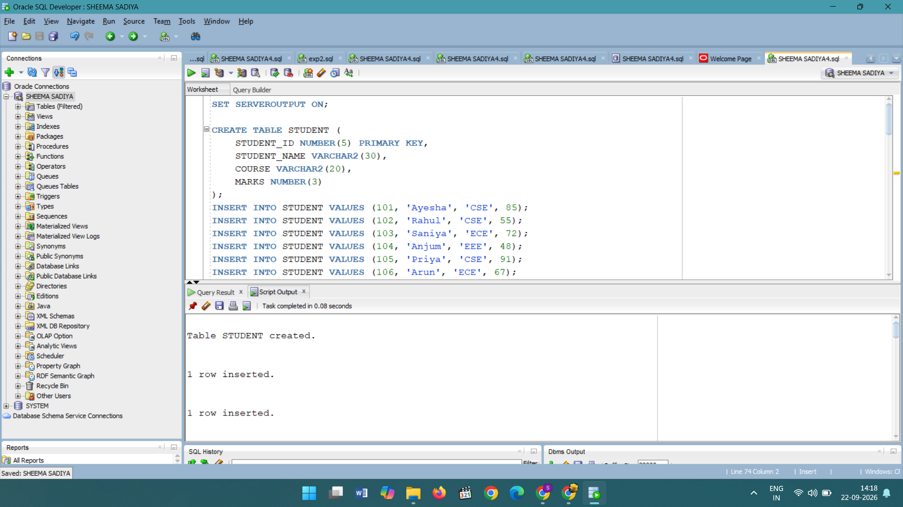
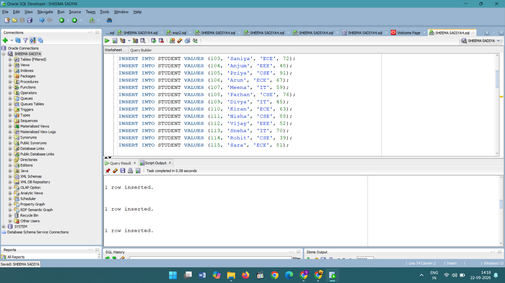
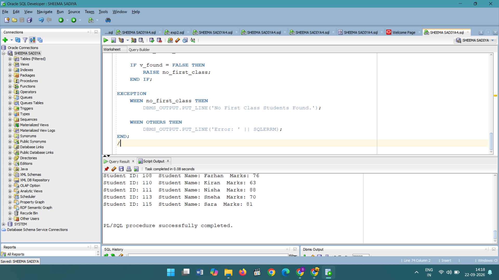
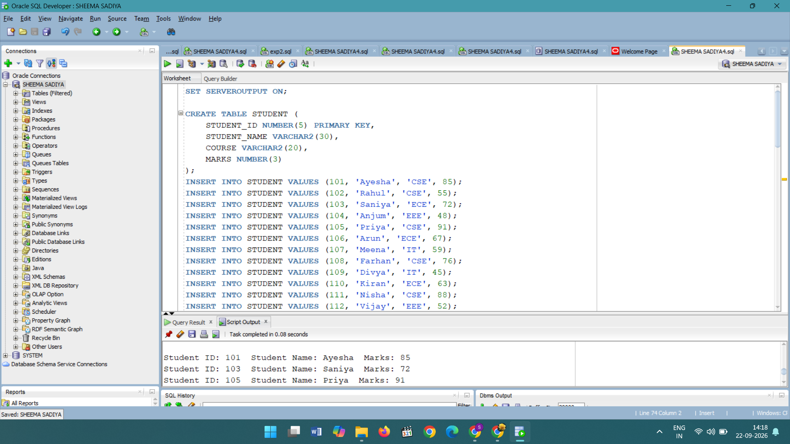
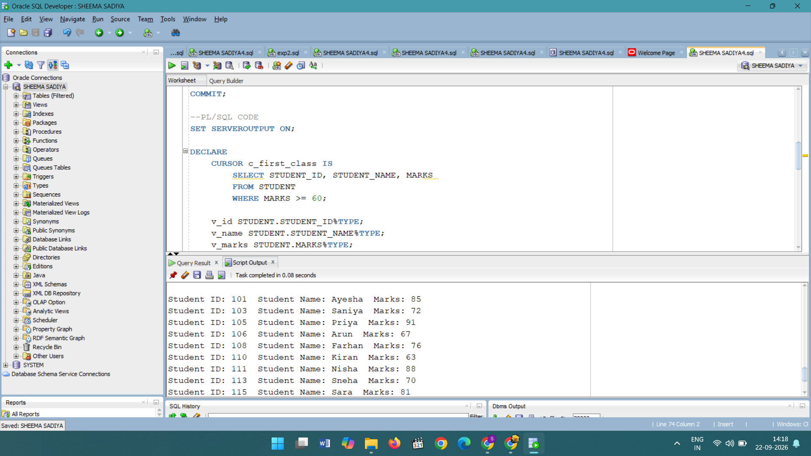

SET SERVEROUTPUT ON;
#student table created
CREATE TABLE STUDENT (
    STUDENT_ID NUMBER(5) PRIMARY KEY,
    STUDENT_NAME VARCHAR2(30),
    COURSE VARCHAR2(20),
    MARKS NUMBER(3)
);

#insert data
INSERT INTO STUDENT VALUES (101, 'Ayesha', 'CSE', 85);
INSERT INTO STUDENT VALUES (102, 'Rahul', 'CSE', 55);
INSERT INTO STUDENT VALUES (103, 'Saniya', 'ECE', 72);
INSERT INTO STUDENT VALUES (104, 'Anjum', 'EEE', 48);
INSERT INTO STUDENT VALUES (105, 'Priya', 'CSE', 91);
INSERT INTO STUDENT VALUES (106, 'Arun', 'ECE', 67);
INSERT INTO STUDENT VALUES (107, 'Meena', 'IT', 59);
INSERT INTO STUDENT VALUES (108, 'Farhan', 'CSE', 76);
INSERT INTO STUDENT VALUES (109, 'Divya', 'IT', 45);
INSERT INTO STUDENT VALUES (110, 'Kiran', 'ECE', 63);
INSERT INTO STUDENT VALUES (111, 'Nisha', 'CSE', 88);
INSERT INTO STUDENT VALUES (112, 'Vijay', 'EEE', 52);
INSERT INTO STUDENT VALUES (113, 'Sneha', 'IT', 70);
INSERT INTO STUDENT VALUES (114, 'Rohit', 'CSE', 39);
INSERT INTO STUDENT VALUES (115, 'Sara', 'ECE', 81);

COMMIT;

#code
--PL/SQL CODE
SET SERVEROUTPUT ON;

DECLARE
    CURSOR c_first_class IS
        SELECT STUDENT_ID, STUDENT_NAME, MARKS
        FROM STUDENT
        WHERE MARKS >= 60;

    v_id STUDENT.STUDENT_ID%TYPE;
    v_name STUDENT.STUDENT_NAME%TYPE;
    v_marks STUDENT.MARKS%TYPE;

    v_found BOOLEAN := FALSE;

    no_first_class EXCEPTION;

BEGIN
    OPEN c_first_class;

    LOOP
        FETCH c_first_class INTO v_id, v_name, v_marks;

        EXIT WHEN c_first_class%NOTFOUND;

        v_found := TRUE;

        DBMS_OUTPUT.PUT_LINE(
            'Student ID: ' || v_id ||
            '  Student Name: ' || v_name ||
            '  Marks: ' || v_marks
        );
    END LOOP;

    CLOSE c_first_class;

    IF v_found = FALSE THEN
        RAISE no_first_class;
    END IF;

EXCEPTION
    WHEN no_first_class THEN
        DBMS_OUTPUT.PUT_LINE('No First Class Students Found.');

    WHEN OTHERS THEN
        DBMS_OUTPUT.PUT_LINE('Error: ' || SQLERRM);
END;
/

