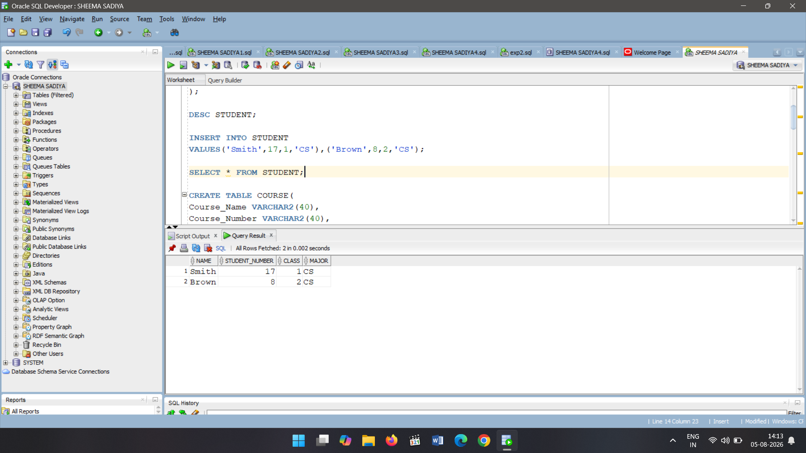
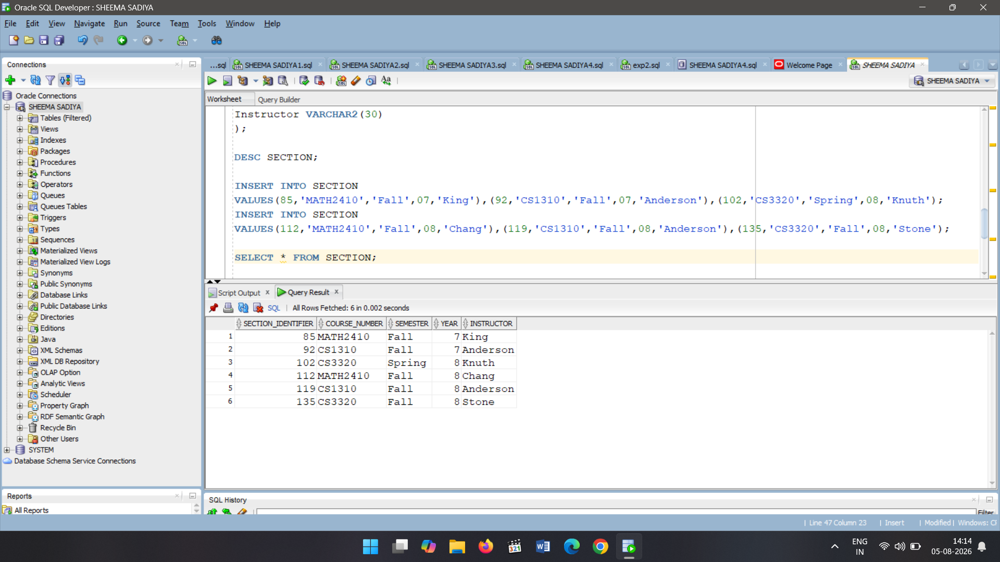
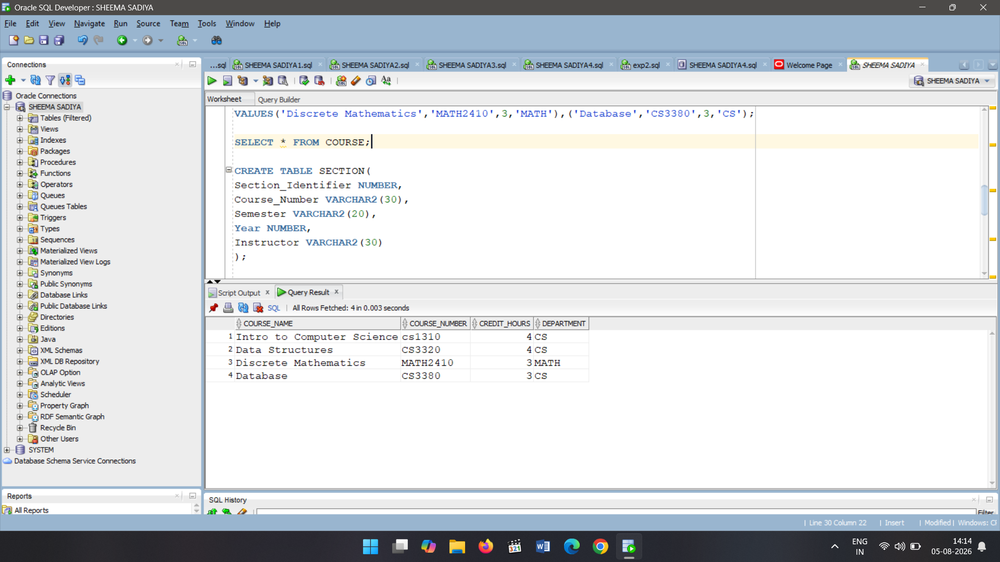
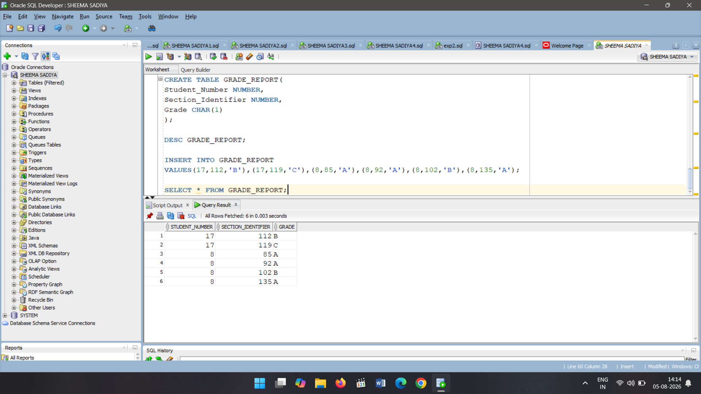

# EXPERIMENT 1 STARTED

'''
## STUDENT TABLE CREATED
CREATE TABLE STUDENT(
Name VARCHAR2(20),
Student_Number NUMBER,
Class NUMBER,
Major VARCHAR2(30)
);

## DESCRIBE STUDENT TABLE
DESC STUDENT;

##INSERT VALUES IN STUDENT TABLE
INSERT INTO STUDENT
VALUES('Smith',17,1,'CS'),('Brown',8,2,'CS');

## DISPLAY STUDENT TABLE
SELECT * FROM STUDENT;

##CREATE COURSE TABLE
CREATE TABLE COURSE(
Course_Name VARCHAR2(40),
Course_Number VARCHAR2(40),
Credit_Hours NUMBER,
Department VARCHAR2(10)
);

##DESCRIBE COURSE TABLE
DESC COURSE;

##INSERT VALUES IN COURSE TABLE
INSERT INTO COURSE
VALUES('Intro to Computer Science','cs1310',4,'CS'),('Data Structures','CS3320',4,'CS');
INSERT INTO COURSE
VALUES('Discrete Mathematics','MATH2410',3,'MATH'),('Database','CS3380',3,'CS');

##DISPLAY COURSE TABLE
SELECT * FROM COURSE;

##CREATE SECTION TABLE
CREATE TABLE SECTION(
Section_Identifier NUMBER,
Course_Number VARCHAR2(30),
Semester VARCHAR2(20),
Year NUMBER,
Instructor VARCHAR2(30)
);

##DESCRIBE SECTION TABLE
DESC SECTION;

##INSERT VALUES IN SECTION TABLE
INSERT INTO SECTION 
VALUES(85,'MATH2410','Fall',07,'King'),(92,'CS1310','Fall',07,'Anderson'),(102,'CS3320','Spring',08,'Knuth');
INSERT INTO SECTION 
VALUES(112,'MATH2410','Fall',08,'Chang'),(119,'CS1310','Fall',08,'Anderson'),(135,'CS3320','Fall',08,'Stone');

##DISPLAY COURSE TABLE
SELECT * FROM SECTION;

##CREATE GRADE_REPORT TABLE
CREATE TABLE GRADE_REPORT(
Student_Number NUMBER,
Section_Identifier NUMBER,
Grade CHAR(1)
);

##DESCRIBE GRADE_REPORT TABLE
DESC GRADE_REPORT;

#INSERT VALUES IN GRADE_REPORT TABLE
INSERT INTO GRADE_REPORT
VALUES(17,112,'B'),(17,119,'C'),(8,85,'A'),(8,92,'A'),(8,102,'B'),(8,135,'A');

#DISPLAY GRADE_REPORT TABLE
SELECT * FROM GRADE_REPORT;

